# API POSTMAN dan Backend With Golang

Menguji API tanpa coding flutter. Melakukan autentikasi berbasis firebase.

Tahapannya:

1. Masuk [Firebase](https://firebase.google.com)

   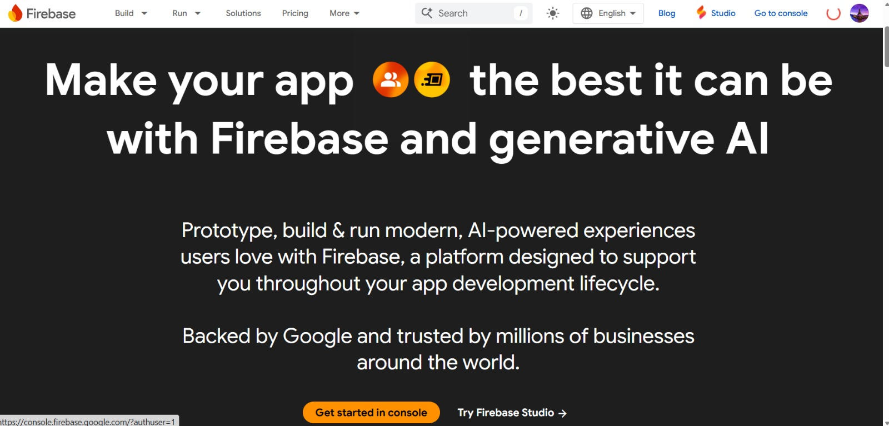

2. Masuk ke Console

   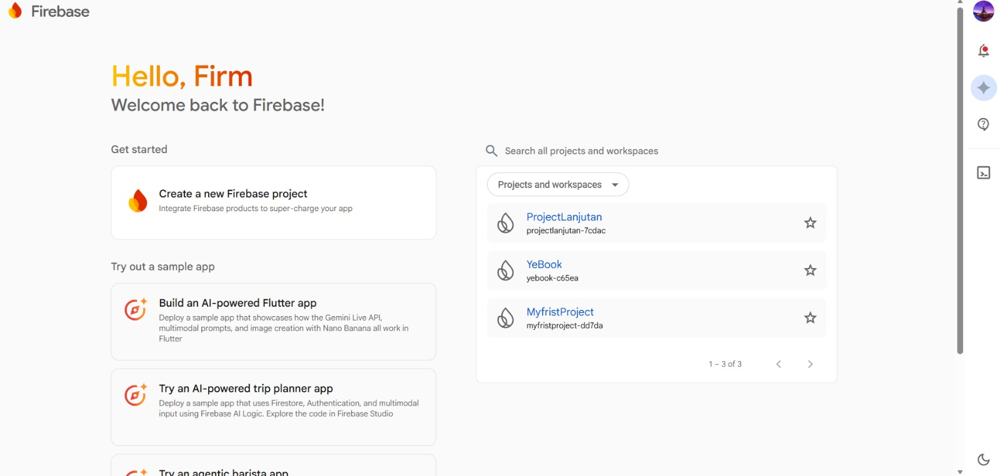

3. Buat Project baru

   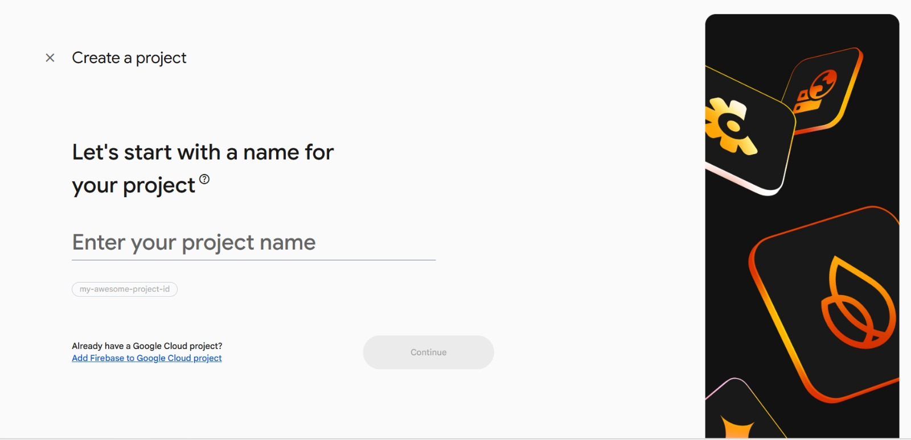

4. Aktifkan autentikasi dengan email/password

   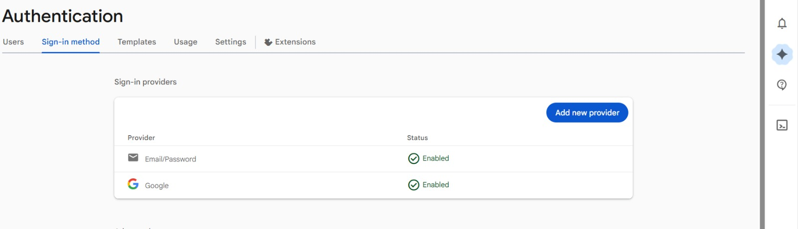

5. Pergi ke Setting > General lalu tambahkan web app

   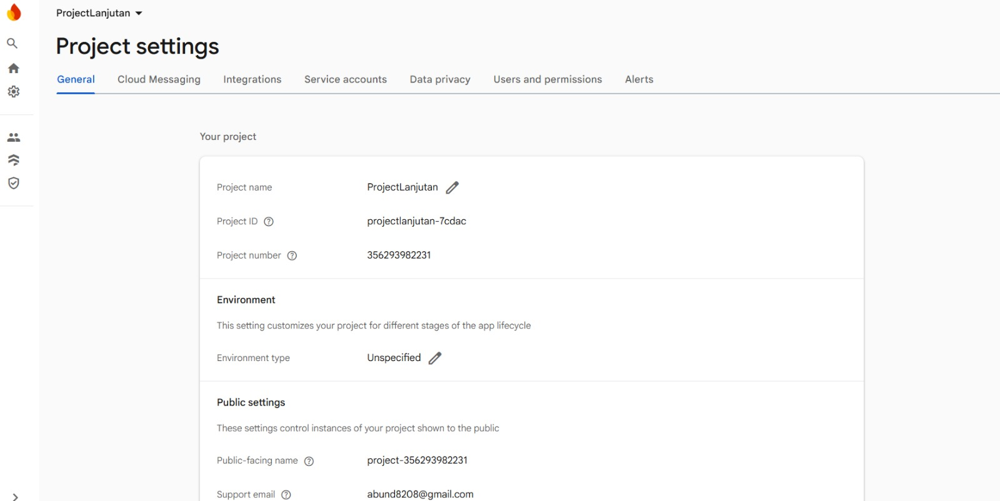

6. Copy apiKey saat menambahkan Web app

   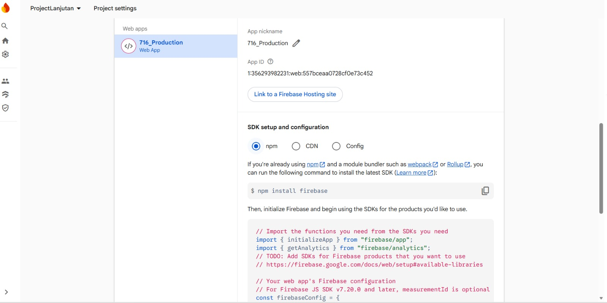

7. Buka Postman dan buat Environments dan tambahkan beberapa variable

   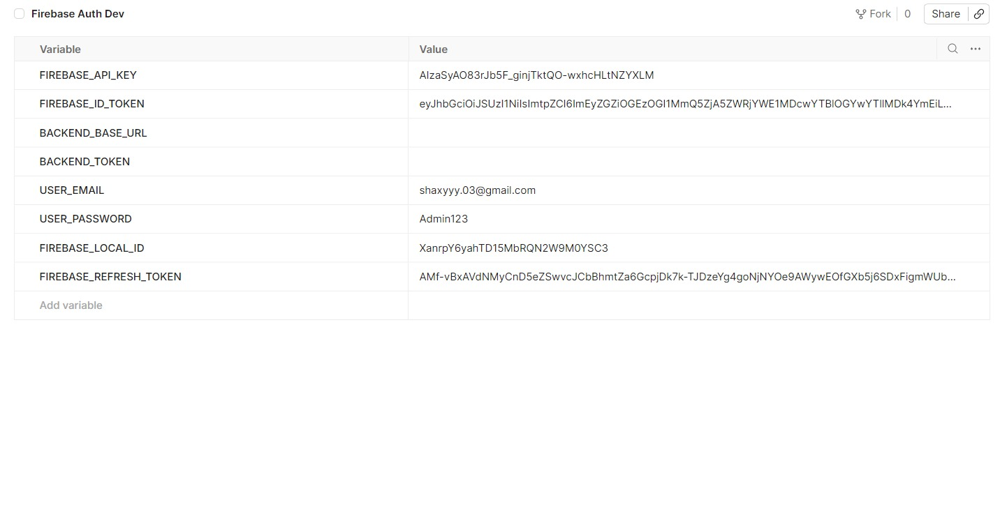

8. Buat Method Sign Up dengan URL sebagai berikut: https://identitytoolkit.googleapis.com/v1/accounts:signUp?key={{FIREBASE_API_KEY}} (Pakai Environments yang tadi kita buat)

   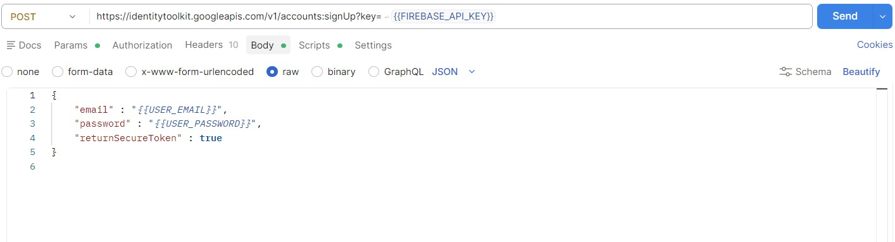

9. Masuk ke body dan ubah jadi raw lalu masukkan payload sebagai berikut
   dan di header tambahkan Content-Type: application/json

   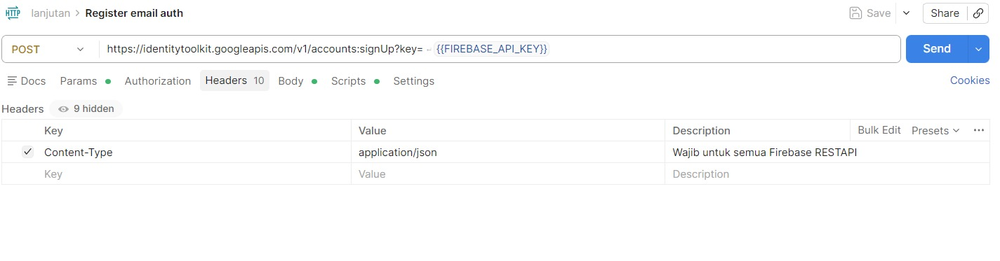

10. Pilih menu Script dan di bagian Post-Response tulis kode berikut untuk auto save id token

```js
// Postman → Tests tab:
const json = pm.response.json();
if (pm.response.code === 200) {
  pm.environment.set("FIREBASE_ID_TOKEN", json.idToken);
  pm.environment.set("FIREBASE_LOCAL_ID", json.localId);
  pm.environment.set("FIREBASE_REFRESH_TOKEN", json.refreshToken);
  console.log("Register sukses. UID:", json.localId);
  console.log("PERHATIAN: Email belum diverifikasi. Lanjut ke Step 2.");
} else {
  console.log("Register gagal:", json.error.message);
}
```

11. Buat method POST untuk kirim link verify: https://identitytoolkit.googleapis.com/v1/accounts:sendOobCode?key={{FIREBASE_API_KEY}}
    lalu di body tambahkan payload seperti di gambar

    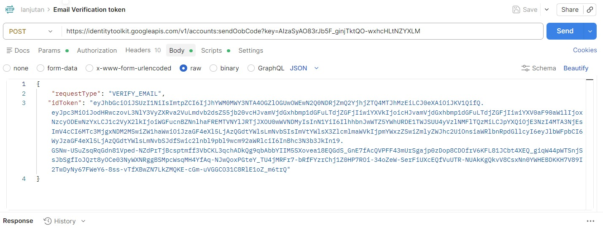

12. Masukkan script berikut pada bagian Post-Response

```js
// Postman → Tests tab:
if (pm.response.code === 200) {
  const json = pm.response.json();
  console.log("Email verifikasi dikirim ke:", json.email);
  console.log("Sekarang buka inbox email dan klik link verifikasi.");
  console.log("Setelah klik, lanjut ke Step 3 untuk cek status.");
} else {
  console.log("Gagal kirim email:", pm.response.json().error.message);
}
```

Untuk cara cek verifikasinya ada 2 cara, melalui Firebase langsung dan backend

## Cara A

buat method POST baru dengan link berikut: https://identitytoolkit.googleapis.com/v1/accounts:lookup?key={{FIREBASE_API_KEY}}

dan di body masukkan payload berikut:

```json
{
  "idToken": "{{FIREBASE_ID_TOKEN}}"
}
```

dan hasilnya seperti ini

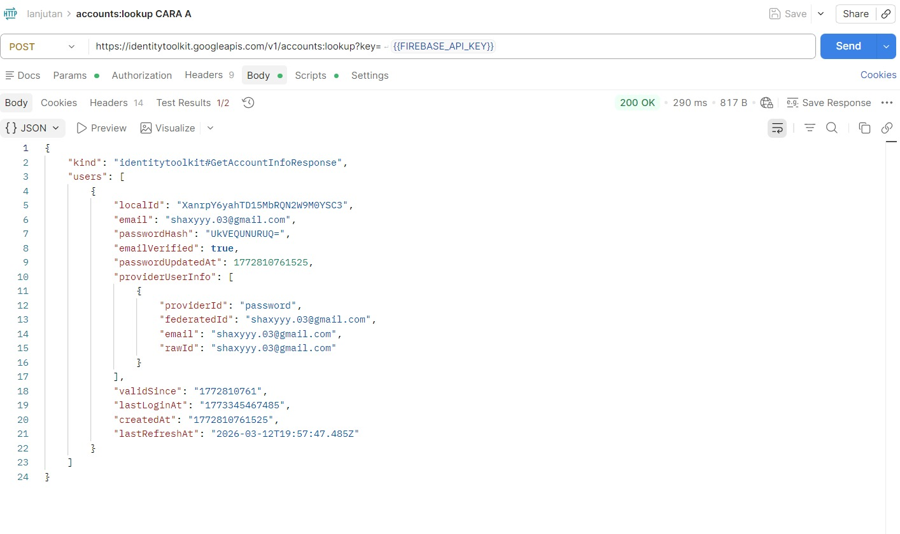

## Cara B

buat method POST dengan link berikut:
{{BACKEND_BASE_URL}}/auth/verify-token

masukkan payload kedalam body:

```json
{
  "firebase_token": "{{FIREBASE_ID_TOKEN}}"
}
```

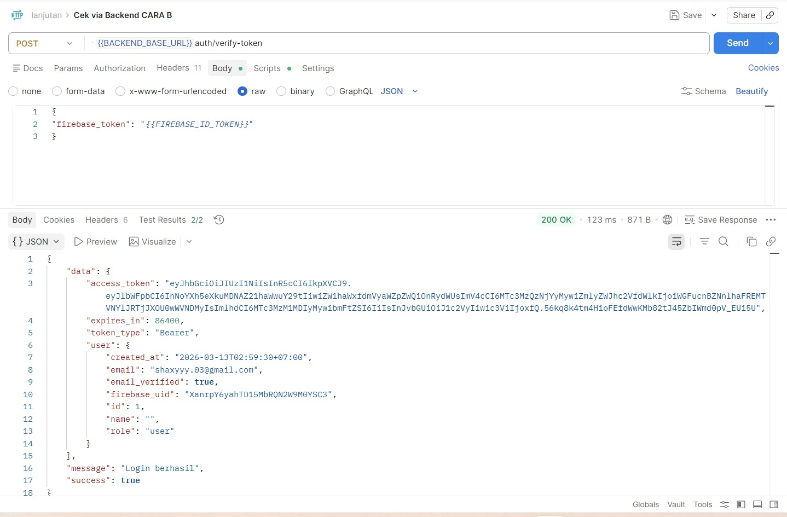

sekarang ke bagian login
untuk Url: https://identitytoolkit.googleapis.com/v1/accounts:signInWithPassword?key={{FIREBASE_API_KEY}}

dan payloadnya sebagai berikut:

```json
{
  "email": "{{USER_EMAIL}}",
  "password": "{{USER_PASSWORD}}",
  "returnSecureToken": "true"
}
```

dan script Post-Response:

```js
// Postman → Tests tab:
const json = pm.response.json();
//Tunggu beberapa menit
if (pm.response.code === 200) {
  // Update environment dengan idToken BARU hasil login
  pm.environment.set("FIREBASE_ID_TOKEN", json.idToken);
  pm.environment.set("FIREBASE_REFRESH_TOKEN", json.refreshToken);
  console.log("Login berhasil. Token diperbarui.");
  console.log("Lanjut ke Step 5: kirim token ke backend.");
} else {
  console.log("Login gagal:", json.error.message);
}
```

dan saat di send hasilnya seperti ini:

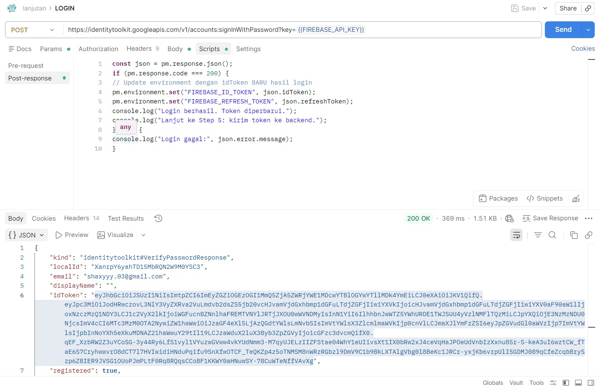

dan kita juga bisa ubah template emailnya

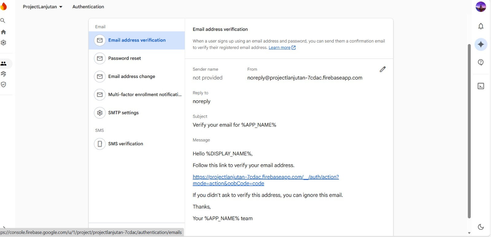

## Code Golang Untuk Testing 

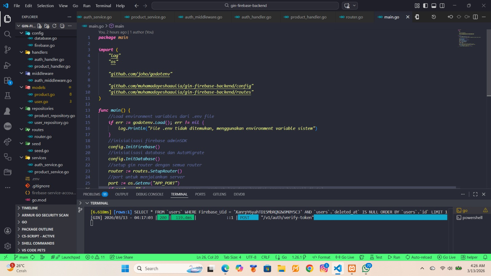

```Golang 
//Run backend Golang
go run main.go
```

## HASIL RUN JIKA BACKEND BERHASIL KONEKSI DATABASE

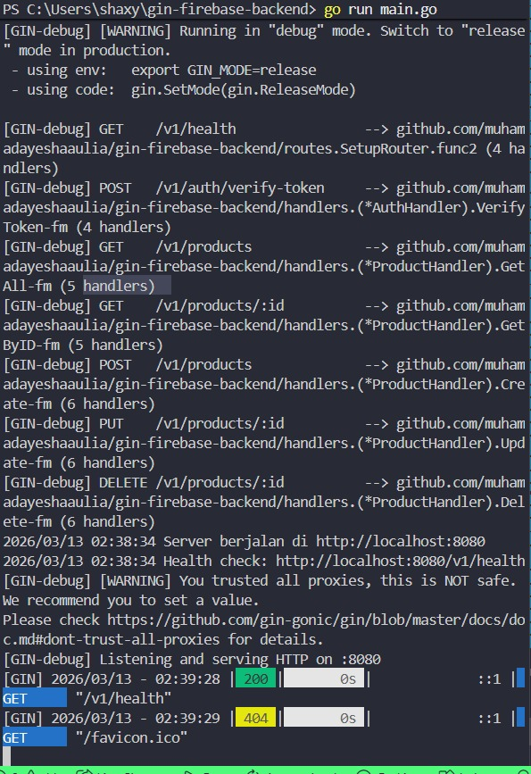

## Test dengan cURL

```golaang
http://localhost:8080/v1/health

```

Hasil 

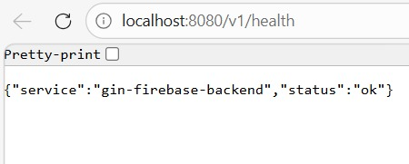

## POST /auth/verify-token (dengan Firebase token)

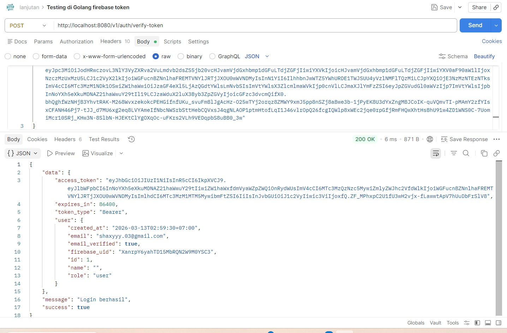

## GET /products (dengan Backend token)

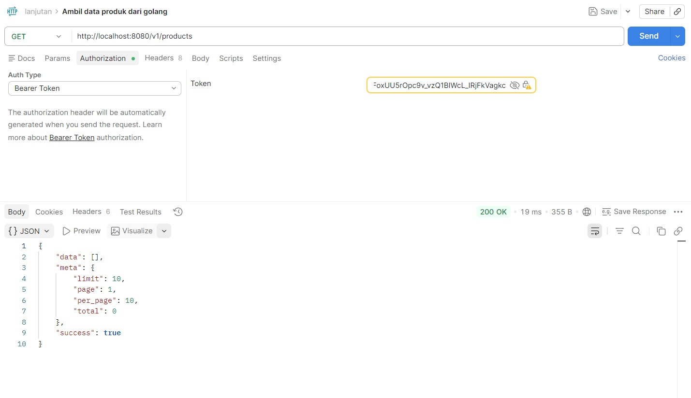

## Verifikasi Tabel di MySQL


## Seed Data Produk untuk Testing

```golang
package main

import (
	"log"

	"github.com/joho/godotenv"

	"github.com/muhamadayeshaaulia/gin-firebase-backend/config"
	"github.com/muhamadayeshaaulia/gin-firebase-backend/models"
)

func main() {
	godotenv.Load()
	config.InitDatabase()
	products := []models.Product{
		{Name: "Nasi Goreng Spesial", Price: 25000, Category: "Makanan", Stock: 50,
			Description: "Nasi goreng dengan telur dan ayam",
			ImageURL:    "https://picsum.photos/400"},
		{Name: "Sate Ayam 10 Tusuk", Price: 20000, Category: "Makanan",
			Stock:       100,
			Description: "Sate ayam dengan bumbu kacang",
			ImageURL:    "https://picsum.photos/401"},
		{Name: "Es Teh Manis", Price: 8000, Category: "Minuman",
			Stock:       200,
			Description: "Es teh manis segar",
			ImageURL:    "https://picsum.photos/402"},
		{Name: "Kopi Susu", Price: 15000, Category: "Minuman",
			Stock:       150,
			Description: "Kopi susu kekinian",
			ImageURL:    "https://picsum.photos/403"},
		{Name: "Ayam Bakar", Price: 30000, Category: "Makanan", Stock: 30,
			Description: "Ayam bakar dengan sambal",
			ImageURL:    "https://picsum.photos/404"},
	}
	for _, p := range products {
		config.DB.Create(&p)
	}
	log.Printf("Seed berhasil: %d produk ditambahkan", len(products))
}
```

RUN SEED 
```golang
go run seed/seed.go

```

HASIL RUN SEED 

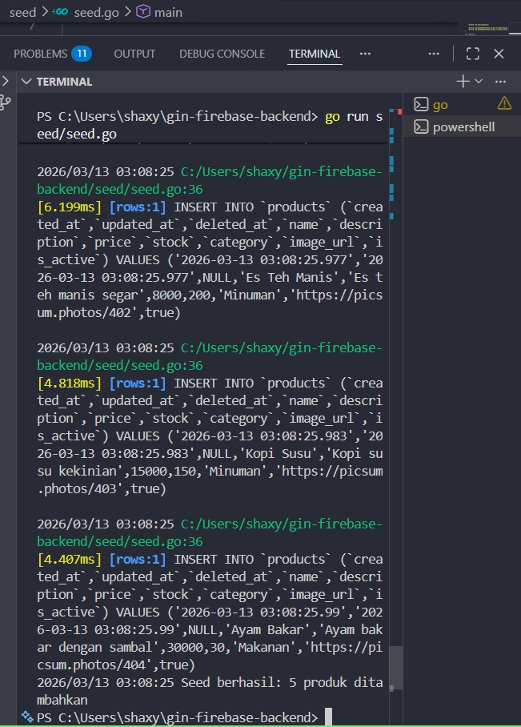

## KONDISI DI DATABASE 

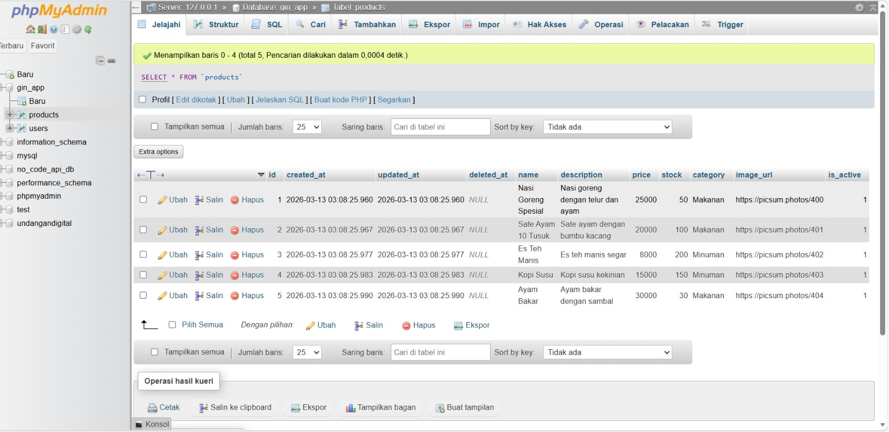